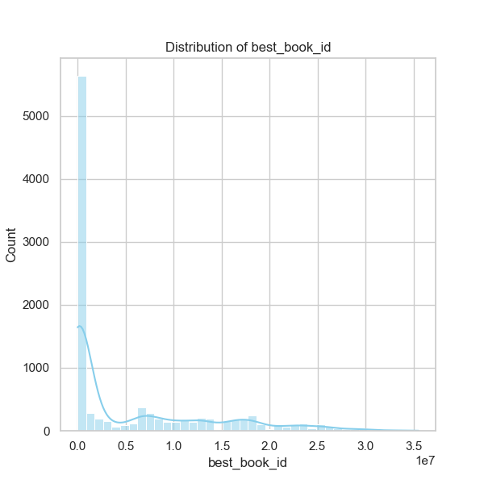
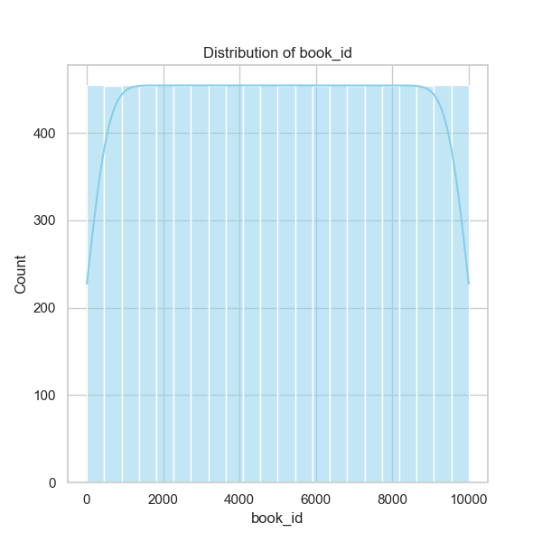
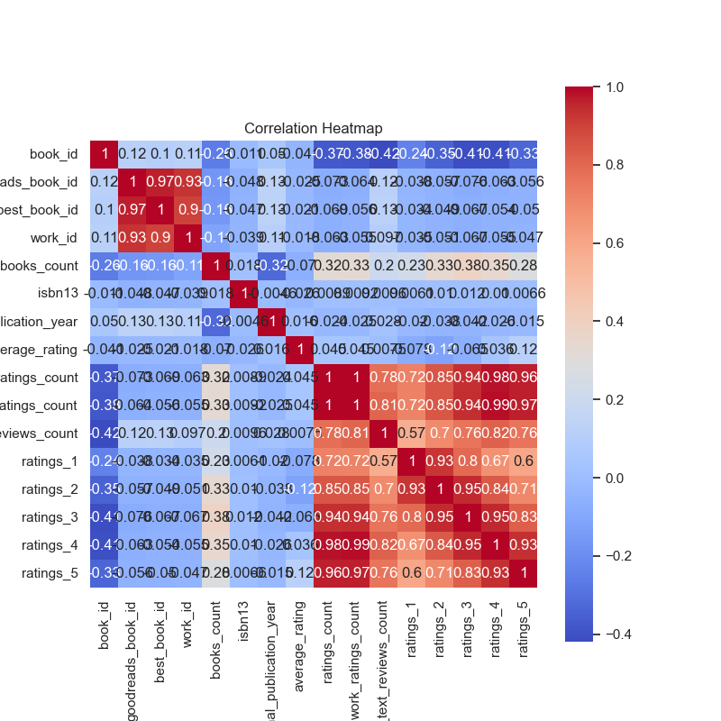
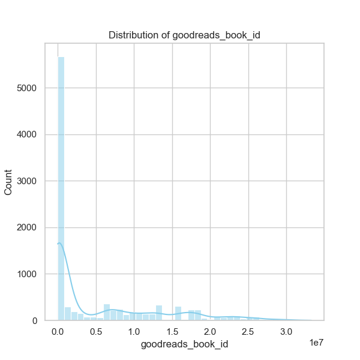

Based on the analysis results from the dataset 'goodreads.csv', we have several insights into the characteristics of books listed on Goodreads, particularly in terms of ratings, publication years, and authorship.

### 1. Summary of Key Trends and Characteristics:
- **Distribution of Book Counts**: The dataset contains 10,000 entries, showcasing a diverse collection of books. The distribution of books per author indicates a mean of approximately 75.7 works per author with a maximum of 3,455 books attributed to a single author, suggesting a presence of prolific authors.
  
- **Average Ratings**: The average rating across the dataset is approximately 4.00, indicating that the overall sentiment towards the books in this collection tends to be positive. However, with a standard deviation of 0.25, there's notable variability in the ratings, indicating that while the average is strong, individual ratings might vary significantly.

- **Publication Year Trends**: The original publication years span from -1750 to 2017, with a median year of 2004. This suggests an interesting mix of contemporary and classic literature. The quartiles provide a useful breakdown: the 25th percentile is 1990 and the 75th percentile is 2011, indicating that a significant number of books in this dataset are likely from the late 20th to early 21st century.

- **Authors and Language**: The dataset has contributions from 4,664 unique authors, with Stephen King being the most frequently occurring author, appearing 60 times. The predominant language for the books is English, with 6341 out of 8916 entries (71.3%) in English.

### 2. Outliers and Anomalies:
- **Ratings Count**: With a maximum ratings count of 4,780,653, one book stands out as potentially an outlier, indicating either extensive popularity or a book that could have benefited from marketing boosts. This kind of extremity in ratings could skew average metrics when analysis is performed on a smaller subset of popular titles.

- **Books Count**: An author with 3,455 works illustrates an anomaly. This could warrant investigation to understand whether this is due to a specific genre, extensive collections (like encyclopedias), or digital volume scaling practices.

### 3. Correlation Insights:
- **Ratings Correlation**: There is a notable positive correlation between ratings counts and the number of one-star to five-star ratings, particularly strong correlation between five-star ratings (0.964) and total ratings count. This suggests that books with higher total ratings tend to perform well across all rating categories, reflecting that popular books attract more ratings. Conversely, the moderate negative correlation with average ratings highlights that high counts often correlate with a mix of reviews, not each individual book being highly rated.

- **Work Text Reviews**: The correlation between work text reviews and ratings count is also quite high (0.779), indicating that books generating more reviews tend to attract more overall ratings, suggesting a robust engagement from readers.

### 4. Suggested Further Analyses:
**Clustering Analysis**: Exploring clustering techniques, such as K-means clustering, could help categorize books based on features like authorship, language, publication years, ratings, and counts. Identifying clusters of similar books can then aid market segmentation, focusing on targeted marketing strategies or enhances recommendations.

**A/B Testing for Recommendations**: Based on the correlations, it might be beneficial to conduct A/B testing on the recommendation system to see if the inclusion of certain features (such as a weighted average rating combined with total reviews) affects user satisfaction and engagement.

**Anomaly Detection**: Implementing anomaly detection algorithms can help identify particularly successful books that deviate from trends discussed, providing insights into what factors contribute to their rising popularity.

### 5. Implications for Future Decisions:
Understanding the dataset's trends can significantly influence marketing strategies, reader engagement, and acquisition planning. Books with high engagement metrics could be prioritized in promotional content, while genres trending in the dataset can signify market opportunities. The presence of varying authorship densities suggests potential avenues for author partnerships or focus areas for future acquisitions if an organization seeks to broaden its catalog.

On a strategic level, recognizing that high ratings and review counts significantly correlate may propel efforts to enhance reader engagement through targeted campaigns and community-building initiatives around popular reads. 

In conclusion, this detailed analysis of the Goodreads dataset not only provides a snapshot of current trends within the reading community but also opens avenues for deeper exploration into reader preferences and engagement strategies.

