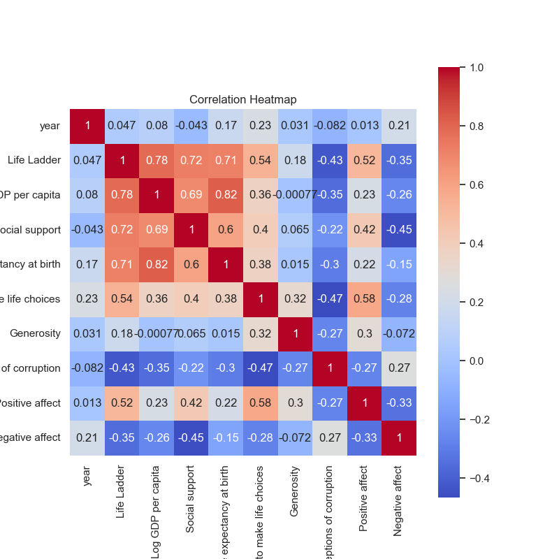
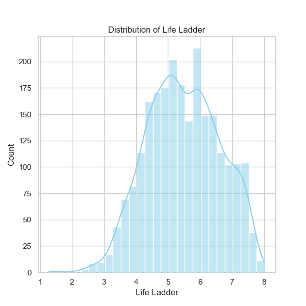
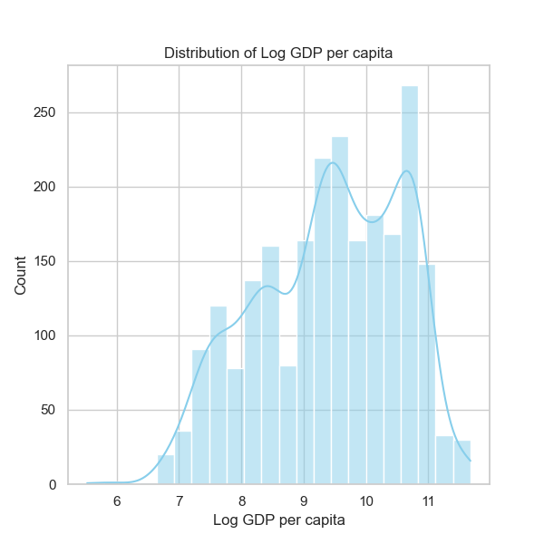
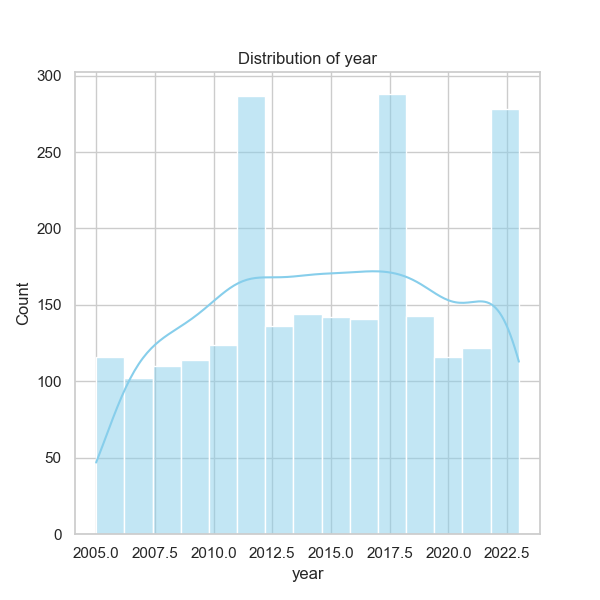

### Narrative of Happiness Data Analysis

#### Overview
The dataset 'happiness.csv' incorporates various factors relevant to measuring happiness across 165 countries over the years 2005 to 2023. The richness of this dataset allows for a multifaceted analysis of how different determinants such as GDP, social support, health, and personal freedoms contribute to perceived life satisfaction, quantified here as the "Life Ladder."

#### Summary of Findings

**Data Summary:**
- The dataset consists of 2,363 entries with notable columns recording various metrics that influence happiness, including GDP per capita, social support, healthy life expectancy, freedom to make life choices, and perceptions of corruption.
- The average 'Life Ladder' score is approximately 5.48, indicating a moderate level of life satisfaction among the surveyed populations.

**Missing Values:**
- The analysis reveals missing values mainly in the columns: 'Log GDP per capita' (28 missing), 'Social support' (13 missing), 'Healthy life expectancy at birth' (63 missing), and more. This missing data needs attention for accurate insights.

**Trends Over Time:**
- The average year of the dataset suggests a focus on more recent data, centering around 2014-2015. As these years progress toward 2023, we might observe evolving trends in happiness metrics, reflecting the impact of emerging global events (e.g., the COVID-19 pandemic).
  
#### Key Relationships and Correlations

1. **Life Ladder vs. Economic Metrics:**
   - A strong positive correlation exists between 'Life Ladder' and 'Log GDP per capita' (0.78), as well as 'Social support' (0.72). These metrics indicate that wealthier nations with robust community support systems are generally happier.
   - Countries with a higher GDP per capita tend to have better living standards, which likely contributes to increased happiness.

2. **Social Conditions:**
   - 'Healthy life expectancy at birth' shows a significant positive correlation with the 'Life Ladder' (0.71). Populations with longer life expectancies also report higher life satisfaction, reinforcing the importance of health in happiness.
   - 'Freedom to make life choices' is another notable factor, positively correlated with life satisfaction at 0.54. This suggests that personal autonomy is critical for perceived happiness.

3. **Negative Influences:**
   - Perceptions of corruption negatively correlate with life satisfaction (-0.43). Higher corruption levels diminish trust in government and societal structures, adversely affecting happiness.

#### Outlier Detection
Potential outliers could exist within the 'Life Ladder' scores or 'Log GDP per capita'. Countries reporting extremely low or high scores in these columns may highlight unique sociopolitical circumstances or data inaccuracies. Further investigation into these outliers can provide deeper insights into the complexities of happiness.

#### Suggested Further Analyses

1. **Clustering Analysis:**
   - Conduct a clustering analysis to categorize countries based on their metrics (GDP, social support, etc.) to identify distinct groups of happiness levels. This could aid in comparing countries within clusters and studying localized policies leading to higher happiness.

2. **Anomaly Detection:**
   - Implement anomaly detection methods to pinpoint countries with disproportionately low 'Life Ladder' scores in comparison to their GDP or social support scores. Understanding these discrepancies can aid in targeted interventions.

3. **Temporal Analysis:**
   - A time series analysis could reveal trends in happiness across different regions and how they coincide with global events, policy changes, or economic swings.

4. **Machine Learning Models:**
   - Train machine learning models to predict 'Life Ladder' scores based on the available features, which may offer further insights into the relative importance of each factor.

#### Future Considerations
The analysis highlights a significant relationship between wealth, health, and happiness, suggesting that maintaining or improving economic stability and social support is vital for increasing life satisfaction. Countries might consider implementing policies aimed at reducing corruption and enhancing personal freedoms to positively influence public happiness.

As psychological and social factors evolve in a post-pandemic world, continual monitoring of these variables will be essential for understanding their impact on global happiness levels. Researchers and policymakers should collaborate on data collection efforts to fill gaps and strengthen the basis for informed decisions.

