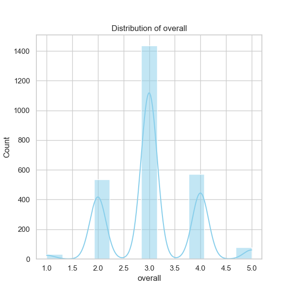

### Narrative Based on Data Analysis of 'media.csv'

#### Overview

The dataset 'media.csv' comprises 2,652 entries across several columns, focusing primarily on media content evaluations. Key columns include the date of entry, language, type, title, contributor (by), and various ratings such as overall, quality, and repeatability. The analysis reveals insights into the media's usage patterns, content quality, and user interactions, which are useful for decision-making in media curation and production.

#### Data Summary

- **Date**: The dataset contains entries from various date points, with a notable peak on '21-May-06,' suggesting a potential event or trend during that time. However, a significant number of entries (99) are missing dates.
- **Language**: The predominant language is English (49.1% of entries), followed by other languages, indicating a strong usage of English content in the dataset.
- **Type**: 'Movies' dominate the dataset, making up approximately 83.4% of all entries. This raises important considerations regarding the representation and analysis of other content types.
- **Title**: With 2,312 unique titles but only a few with high frequencies, "Kanda Naal Mudhal" stands out as the most recorded title (9 instances), indicating a potential niche following or popularity that warrants further investigation.
- **By**: The highest contributor is Kiefer Sutherland (48 times), indicating the prominence of specific personalities in media contributions.
  
#### Rating Insights

- **Overall Rating**: The overall rated mean is approximately 3.05 out of 5, suggesting a mediocre satisfaction level among users. The ratings show little variation given a standard deviation of 0.76.
- **Quality Rating**: With a mean of 3.21 and similar statistical properties, quality ratings are slightly more favorable than overall ratings, hinting that users might appreciate the quality of content more than its overall experience.
- **Repeatability**: This metric scores lower with a mean of approximately 1.49, indicating many users may not revisit or recommend the media content, which is alarming for potential content producers.

#### Missing Values

The data presents issues with missing entries:
- **Date**: 99 missing values might distort time-dependent trends and analyses.
- **By**: The high number of missing contributors (262) may limit insights into who influences the media landscape significantly.

#### Correlation Observations

The correlation matrix reveals:
- A strong positive correlation (0.83) between overall and quality ratings. This indicates that higher quality is likely associated with higher overall satisfaction.
- A moderate correlation (0.51) exists between overall and repeatability ratings, suggesting that higher overall satisfaction may lead to greater repeat engagement, although this is not excessively strong.
  
#### Trends and Patterns

1. **Temporal Insights**: The date trends suggest assessing the entries over time could yield insights into evolving media preferences and patterns. The frequency of missing dates, however, complicates this analysis.
2. **Content Consumption**: The dominance of English movies combined with the limited frequency of other languages or types indicates a potential market gap for non-English media.
3. **User Engagement**: The higher ratings for quality but lower for repeatability signal that while content may meet quality expectations, engagement levels may not sustain user interest over time.

#### Future Analysis Recommendations

1. **Clustering Analysis**: Utilizing clustering algorithms (like K-Means) can help to identify groupings of media based on ratings and features. Clustering can aid in tailoring future content more closely aligned with user preferences.
   
2. **Anomaly Detection**: Implementing anomaly detection methods could help identify unusual patterns in the data, such as outlier ratings for certain media types or titles that deviate significantly from average expectations.

3. **Time Series Analysis**: If missing dates can be reconciled, analyzing how ratings and types have evolved over time would provide valuable insights into user trends and market shifts.
  
4. **Text Analysis on Titles and Contributors**: Exploring the titles and contributor names through text analysis may reveal patterns or common characteristics associated with higher-rated content.

5. **Engagement Metrics**: Further studies could focus on factors influencing repeatability, such as user demographics or marketing strategies.

#### Potential Impacts on Future Decisions

Understanding these trends may guide strategic decisions in media production, marketing, and curation. Emphasizing quality in content creation, while leveraging insights around user engagement metrics, can maximize user retention and satisfaction rates. Identifying media types that are underrepresented but have potential user interest could also enable more targeted and appealing content offerings. 

By analyzing these facets systematically, stakeholders can better navigate the competitive media landscape, potentially leading to enhanced viewer satisfaction and loyalty.

